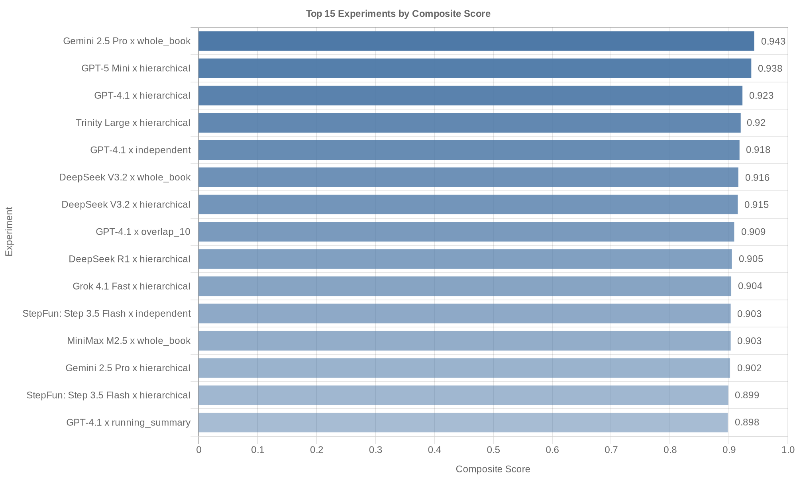
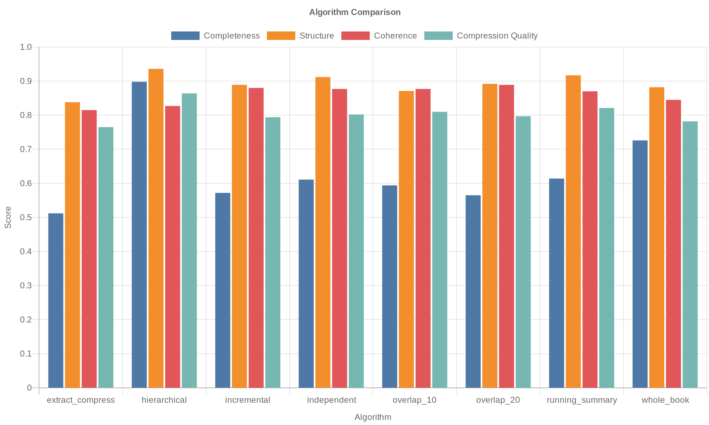
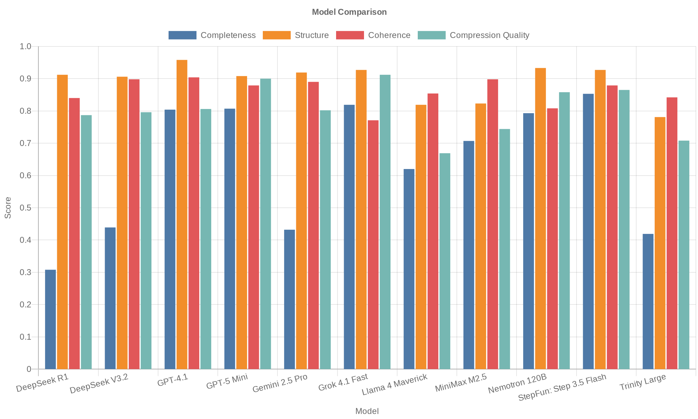
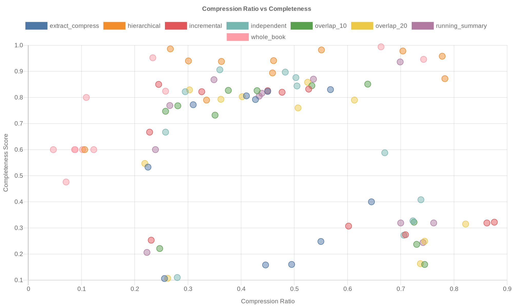
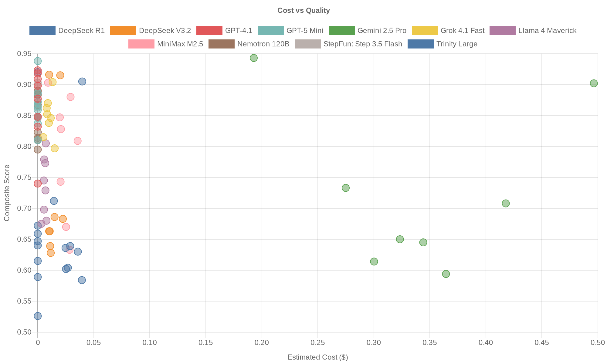

# Distillation Research Report

Generated: 2026-03-22

## Overview

88 experiments evaluated across 11 models and 8 algorithms.
Metric weights: Completeness (0.35), Structure Preservation (0.25), Coherence (0.25), Compression Quality (0.15).

## Leaderboard

| Rank | Model | Algorithm | Composite | Completeness | Structure | Coherence | Compression Quality | Compression Ratio | tok/s |
|------|-------|-----------|-----------|--------------|-----------|-----------|---------------------|-------------------|-------|
| 1 | Gemini 2.5 Pro | whole_book | 0.94 | 0.99 | 1.00 | 0.90 | 0.80 | 0.66 | 146.0 |
| 2 | GPT-5 Mini | hierarchical | 0.94 | 0.94 | 0.90 | 1.00 | 0.90 | 0.36 | 77.0 |
| 3 | GPT-4.1 | hierarchical | 0.92 | 0.89 | 1.00 | 0.90 | 0.90 | 0.46 | 195.7 |
| 4 | Trinity Large | hierarchical | 0.92 | 0.96 | 1.00 | 0.80 | 0.90 | 0.78 | 28.7 |
| 5 | GPT-4.1 | independent | 0.92 | 0.90 | 0.98 | 0.88 | 0.92 | 0.48 | 188.9 |
| 6 | DeepSeek V3.2 | whole_book | 0.92 | 0.95 | 0.90 | 0.90 | 0.90 | 0.74 | 48.2 |
| 7 | DeepSeek V3.2 | hierarchical | 0.92 | 0.87 | 1.00 | 0.90 | 0.90 | 0.78 | 30.8 |
| 8 | GPT-4.1 | overlap_10 | 0.91 | 0.85 | 0.98 | 0.90 | 0.95 | 0.53 | 125.0 |
| 9 | DeepSeek R1 | hierarchical | 0.91 | 0.99 | 1.00 | 0.70 | 0.90 | 0.27 | 55.0 |
| 10 | Grok 4.1 Fast | hierarchical | 0.90 | 0.94 | 1.00 | 0.70 | 1.00 | 0.30 | 146.0 |
| 11 | StepFun: Step 3.5 Flash | independent | 0.90 | 0.88 | 0.97 | 0.90 | 0.87 | 0.50 | 54.6 |
| 12 | MiniMax M2.5 | whole_book | 0.90 | 0.95 | 0.90 | 0.90 | 0.80 | 0.23 | 62.8 |
| 13 | Gemini 2.5 Pro | hierarchical | 0.90 | 0.98 | 0.90 | 0.80 | 0.90 | 0.70 | 121.7 |
| 14 | StepFun: Step 3.5 Flash | hierarchical | 0.90 | 0.94 | 0.90 | 0.90 | 0.80 | 0.46 | 67.4 |
| 15 | GPT-4.1 | running_summary | 0.90 | 0.82 | 1.00 | 0.90 | 0.92 | 0.44 | 165.5 |
| 16 | Nemotron 120B | independent | 0.89 | 0.91 | 0.95 | 0.85 | 0.82 | 0.36 | 24.1 |
| 17 | StepFun: Step 3.5 Flash | whole_book | 0.89 | 0.82 | 1.00 | 0.80 | 1.00 | 0.26 | 68.3 |
| 18 | GPT-5 Mini | independent | 0.89 | 0.84 | 0.90 | 0.88 | 0.97 | 0.50 | 74.2 |
| 19 | StepFun: Step 3.5 Flash | overlap_20 | 0.89 | 0.86 | 0.92 | 0.93 | 0.82 | 0.53 | 59.0 |
| 20 | Nemotron 120B | running_summary | 0.88 | 0.87 | 0.98 | 0.82 | 0.87 | 0.35 | 22.7 |
| 21 | StepFun: Step 3.5 Flash | running_summary | 0.88 | 0.87 | 0.90 | 0.88 | 0.88 | 0.54 | 46.9 |
| 22 | MiniMax M2.5 | running_summary | 0.88 | 0.94 | 0.85 | 0.90 | 0.77 | 0.70 | 34.4 |
| 23 | GPT-4.1 | incremental | 0.88 | 0.83 | 0.93 | 0.90 | 0.85 | 0.53 | 155.7 |
| 24 | GPT-5 Mini | running_summary | 0.87 | 0.81 | 0.95 | 0.90 | 0.85 | 0.43 | 79.9 |
| 25 | StepFun: Step 3.5 Flash | overlap_10 | 0.87 | 0.83 | 0.93 | 0.87 | 0.88 | 0.43 | 63.6 |
| 26 | Grok 4.1 Fast | overlap_20 | 0.87 | 0.83 | 0.95 | 0.80 | 0.95 | 0.30 | 124.7 |
| 27 | Nemotron 120B | incremental | 0.87 | 0.82 | 0.95 | 0.87 | 0.83 | 0.33 | 19.0 |
| 28 | GPT-5 Mini | overlap_20 | 0.87 | 0.80 | 0.90 | 0.92 | 0.87 | 0.40 | 74.9 |
| 29 | StepFun: Step 3.5 Flash | incremental | 0.86 | 0.83 | 0.92 | 0.87 | 0.85 | 0.45 | 51.3 |
| 30 | Grok 4.1 Fast | independent | 0.86 | 0.82 | 0.93 | 0.83 | 0.88 | 0.29 | 123.2 |
| 31 | GPT-5 Mini | overlap_10 | 0.86 | 0.83 | 0.87 | 0.88 | 0.88 | 0.38 | 75.6 |
| 32 | Grok 4.1 Fast | overlap_10 | 0.85 | 0.77 | 0.95 | 0.83 | 0.92 | 0.28 | 119.0 |
| 33 | GPT-4.1 | overlap_20 | 0.85 | 0.76 | 0.88 | 0.92 | 0.88 | 0.51 | 197.8 |
| 34 | Nemotron 120B | overlap_20 | 0.85 | 0.79 | 0.97 | 0.82 | 0.83 | 0.36 | 26.0 |
| 35 | GPT-5 Mini | incremental | 0.85 | 0.82 | 0.83 | 0.90 | 0.85 | 0.48 | 76.3 |
| 36 | MiniMax M2.5 | overlap_10 | 0.85 | 0.85 | 0.80 | 0.92 | 0.80 | 0.64 | 43.6 |
| 37 | StepFun: Step 3.5 Flash | extract_compress | 0.85 | 0.81 | 0.88 | 0.88 | 0.82 | 0.41 | 59.4 |
| 38 | Grok 4.1 Fast | running_summary | 0.85 | 0.77 | 0.93 | 0.83 | 0.90 | 0.27 | 114.3 |
| 39 | Grok 4.1 Fast | incremental | 0.84 | 0.85 | 0.88 | 0.77 | 0.85 | 0.24 | 116.7 |
| 40 | GPT-5 Mini | extract_compress | 0.84 | 0.82 | 0.92 | 0.75 | 0.88 | 0.45 | 76.3 |
| 41 | GPT-4.1 | extract_compress | 0.83 | 0.79 | 0.88 | 0.83 | 0.83 | 0.43 | 190.9 |
| 42 | MiniMax M2.5 | overlap_20 | 0.83 | 0.79 | 0.82 | 0.90 | 0.82 | 0.61 | 23.7 |
| 43 | Nemotron 120B | extract_compress | 0.82 | 0.83 | 0.87 | 0.73 | 0.88 | 0.57 | 36.6 |
| 44 | Grok 4.1 Fast | whole_book | 0.81 | 0.80 | 0.90 | 0.70 | 0.90 | 0.11 | 106.7 |
| 45 | Nemotron 120B | overlap_10 | 0.81 | 0.73 | 0.85 | 0.88 | 0.83 | 0.35 | 28.7 |
| 46 | Nemotron 120B | hierarchical | 0.81 | 0.79 | 1.00 | 0.60 | 0.90 | 0.34 | 26.9 |
| 47 | GPT-5 Mini | whole_book | 0.81 | 0.60 | 1.00 | 0.80 | 1.00 | 0.12 | 66.1 |
| 48 | MiniMax M2.5 | hierarchical | 0.81 | 0.98 | 0.60 | 0.90 | 0.60 | 0.55 | 64.2 |
| 49 | Llama 4 Maverick | hierarchical | 0.80 | 0.60 | 1.00 | 0.90 | 0.80 | 0.11 | 97.6 |
| 50 | Grok 4.1 Fast | extract_compress | 0.80 | 0.77 | 0.87 | 0.70 | 0.90 | 0.31 | 127.4 |
| 51 | Nemotron 120B | whole_book | 0.80 | 0.60 | 0.90 | 0.90 | 0.90 | 0.10 | 63.8 |
| 52 | Llama 4 Maverick | overlap_10 | 0.78 | 0.75 | 0.80 | 0.85 | 0.70 | 0.26 | 57.2 |
| 53 | Llama 4 Maverick | incremental | 0.77 | 0.67 | 0.87 | 0.88 | 0.68 | 0.23 | 87.8 |
| 54 | Llama 4 Maverick | independent | 0.74 | 0.67 | 0.80 | 0.87 | 0.63 | 0.26 | 79.0 |
| 55 | MiniMax M2.5 | independent | 0.74 | 0.59 | 0.85 | 0.90 | 0.67 | 0.67 | 55.1 |
| 56 | GPT-4.1 | whole_book | 0.74 | 0.60 | 1.00 | 1.00 | 0.20 | 0.09 | 170.1 |
| 57 | Gemini 2.5 Pro | independent | 0.73 | 0.41 | 0.95 | 0.90 | 0.85 | 0.74 | 121.8 |
| 58 | Llama 4 Maverick | running_summary | 0.73 | 0.60 | 0.83 | 0.83 | 0.68 | 0.24 | 52.0 |
| 59 | DeepSeek R1 | whole_book | 0.71 | 0.48 | 0.90 | 0.80 | 0.80 | 0.07 | 15.6 |
| 60 | Gemini 2.5 Pro | running_summary | 0.71 | 0.32 | 0.97 | 0.90 | 0.87 | 0.76 | 119.1 |
| 61 | Llama 4 Maverick | overlap_20 | 0.70 | 0.55 | 0.80 | 0.87 | 0.60 | 0.22 | 64.4 |
| 62 | DeepSeek V3.2 | running_summary | 0.69 | 0.32 | 0.92 | 0.90 | 0.80 | 0.70 | 14.6 |
| 63 | DeepSeek V3.2 | incremental | 0.68 | 0.32 | 0.92 | 0.90 | 0.78 | 0.86 | 40.4 |
| 64 | Llama 4 Maverick | extract_compress | 0.68 | 0.53 | 0.75 | 0.83 | 0.65 | 0.23 | 94.0 |
| 65 | Llama 4 Maverick | whole_book | 0.68 | 0.60 | 0.70 | 0.80 | 0.60 | 0.05 | 83.9 |
| 66 | Trinity Large | incremental | 0.67 | 0.32 | 0.87 | 0.90 | 0.78 | 0.88 | 24.6 |
| 67 | MiniMax M2.5 | incremental | 0.67 | 0.31 | 0.90 | 0.90 | 0.75 | 0.60 | 49.5 |
| 68 | DeepSeek V3.2 | independent | 0.66 | 0.33 | 0.88 | 0.90 | 0.68 | 0.72 | 23.3 |
| 69 | DeepSeek V3.2 | overlap_10 | 0.66 | 0.32 | 0.87 | 0.88 | 0.75 | 0.73 | 17.8 |
| 70 | Trinity Large | overlap_20 | 0.66 | 0.31 | 0.88 | 0.88 | 0.72 | 0.82 | 27.1 |
| 71 | Gemini 2.5 Pro | incremental | 0.65 | 0.27 | 0.87 | 0.90 | 0.75 | 0.71 | 117.4 |
| 72 | Trinity Large | independent | 0.65 | 0.27 | 0.90 | 0.87 | 0.73 | 0.71 | 11.9 |
| 73 | Gemini 2.5 Pro | overlap_20 | 0.65 | 0.16 | 0.95 | 0.93 | 0.78 | 0.74 | 116.6 |
| 74 | Trinity Large | whole_book | 0.64 | 0.60 | 0.50 | 0.80 | 0.70 | 0.09 | 45.3 |
| 75 | DeepSeek V3.2 | overlap_20 | 0.64 | 0.25 | 0.85 | 0.92 | 0.73 | 0.74 | 15.9 |
| 76 | DeepSeek R1 | incremental | 0.64 | 0.25 | 0.85 | 0.90 | 0.75 | 0.23 | 56.7 |
| 77 | DeepSeek R1 | overlap_10 | 0.64 | 0.22 | 0.92 | 0.87 | 0.75 | 0.25 | 23.4 |
| 78 | MiniMax M2.5 | extract_compress | 0.63 | 0.25 | 0.87 | 0.87 | 0.75 | 0.55 | 33.4 |
| 79 | DeepSeek R1 | running_summary | 0.63 | 0.21 | 0.95 | 0.83 | 0.75 | 0.22 | 41.3 |
| 80 | DeepSeek V3.2 | extract_compress | 0.63 | 0.16 | 0.92 | 0.88 | 0.82 | 0.45 | 13.4 |
| 81 | Trinity Large | running_summary | 0.61 | 0.24 | 0.80 | 0.87 | 0.75 | 0.74 | 24.5 |
| 82 | Gemini 2.5 Pro | overlap_10 | 0.61 | 0.16 | 0.85 | 0.90 | 0.80 | 0.75 | 121.5 |
| 83 | DeepSeek R1 | independent | 0.60 | 0.11 | 0.92 | 0.87 | 0.80 | 0.28 | 25.2 |
| 84 | DeepSeek R1 | overlap_20 | 0.60 | 0.11 | 0.90 | 0.90 | 0.77 | 0.26 | 47.1 |
| 85 | Gemini 2.5 Pro | extract_compress | 0.59 | 0.16 | 0.87 | 0.88 | 0.67 | 0.49 | 107.5 |
| 86 | Trinity Large | overlap_10 | 0.59 | 0.24 | 0.77 | 0.87 | 0.65 | 0.73 | 12.0 |
| 87 | DeepSeek R1 | extract_compress | 0.58 | 0.11 | 0.87 | 0.85 | 0.78 | 0.26 | 26.0 |
| 88 | Trinity Large | extract_compress | 0.53 | 0.40 | 0.53 | 0.75 | 0.43 | 0.65 | 20.2 |

## Algorithm Analysis

| Algorithm | Completeness | Structure | Coherence | Compression Quality | Composite |
|-----------|--------------|-----------|-----------|---------------------|-----------|
| hierarchical | 0.90 | 0.94 | 0.83 | 0.86 | 0.88 |
| whole_book | 0.73 | 0.88 | 0.85 | 0.78 | 0.80 |
| running_summary | 0.61 | 0.92 | 0.87 | 0.82 | 0.78 |
| independent | 0.61 | 0.91 | 0.88 | 0.80 | 0.78 |
| overlap_10 | 0.59 | 0.87 | 0.88 | 0.81 | 0.77 |
| overlap_20 | 0.56 | 0.89 | 0.89 | 0.80 | 0.76 |
| incremental | 0.57 | 0.89 | 0.88 | 0.79 | 0.76 |
| extract_compress | 0.51 | 0.84 | 0.82 | 0.77 | 0.71 |

**Best algorithm: hierarchical** (composite: 0.88)

## Model Analysis

| Model | Completeness | Structure | Coherence | Compression Quality | Composite |
|-------|--------------|-----------|-----------|---------------------|-----------|
| StepFun: Step 3.5 Flash | 0.85 | 0.93 | 0.88 | 0.86 | 0.88 |
| GPT-4.1 | 0.80 | 0.96 | 0.90 | 0.81 | 0.87 |
| GPT-5 Mini | 0.81 | 0.91 | 0.88 | 0.90 | 0.86 |
| Grok 4.1 Fast | 0.82 | 0.93 | 0.77 | 0.91 | 0.85 |
| Nemotron 120B | 0.79 | 0.93 | 0.81 | 0.86 | 0.84 |
| MiniMax M2.5 | 0.71 | 0.82 | 0.90 | 0.74 | 0.79 |
| Llama 4 Maverick | 0.62 | 0.82 | 0.85 | 0.67 | 0.74 |
| DeepSeek V3.2 | 0.44 | 0.91 | 0.90 | 0.80 | 0.72 |
| Gemini 2.5 Pro | 0.43 | 0.92 | 0.89 | 0.80 | 0.72 |
| DeepSeek R1 | 0.31 | 0.91 | 0.84 | 0.79 | 0.66 |
| Trinity Large | 0.42 | 0.78 | 0.84 | 0.71 | 0.66 |

**Best model: StepFun: Step 3.5 Flash** (composite: 0.88)

## Throughput (output tok/s)

| Model | Avg tok/s | Min | Max |
|-------|-----------|-----|-----|
| DeepSeek R1 | 36.3 | 15.6 | 56.7 |
| DeepSeek V3.2 | 25.5 | 13.4 | 48.2 |
| GPT-4.1 | 173.7 | 125.0 | 197.8 |
| GPT-5 Mini | 75.0 | 66.1 | 79.9 |
| Gemini 2.5 Pro | 121.4 | 107.5 | 146.0 |
| Grok 4.1 Fast | 122.2 | 106.7 | 146.0 |
| Llama 4 Maverick | 77.0 | 52.0 | 97.6 |
| MiniMax M2.5 | 45.9 | 23.7 | 64.2 |
| Nemotron 120B | 31.0 | 19.0 | 63.8 |
| StepFun: Step 3.5 Flash | 58.8 | 46.9 | 68.3 |
| Trinity Large | 24.3 | 11.9 | 45.3 |

## Cost Comparison

| Model | Cost per Chapter | Total Estimated Cost |
|-------|------------------|----------------------|
| GPT-4.1 | $0.0000 | $0.0000 |
| GPT-5 Mini | $0.0000 | $0.0000 |
| Nemotron 120B | $0.0000 | $0.0000 |
| StepFun: Step 3.5 Flash | $0.0000 | $0.0000 |
| Trinity Large | $0.0000 | $0.0000 |
| Llama 4 Maverick | $0.0021 | $0.0487 |
| Grok 4.1 Fast | $0.0036 | $0.0804 |
| DeepSeek V3.2 | $0.0055 | $0.1112 |
| MiniMax M2.5 | $0.0086 | $0.1886 |
| DeepSeek R1 | $0.0105 | $0.2352 |
| Gemini 2.5 Pro | $0.1283 | $2.7139 |

## Charts

### Leaderboard

### Algorithm Comparison

### Model Comparison

### Compression vs Completeness

### Cost vs Quality

## Recommendations

### Recommended Algorithm

**hierarchical** -- highest average composite score (0.88) across all models.

### Recommended Models

- **Best Free**: GPT-5 Mini (composite: 0.94)
- **Best Budget**: Grok 4.1 Fast (composite: 0.86, cost: $0.0013/chapter)
- **Best Quality**: Gemini 2.5 Pro (composite: 0.94)

### Key Insights

- **hierarchical** is the top algorithm with a composite score of 0.88, outperforming **extract_compress** by 0.18 points.
- **StepFun: Step 3.5 Flash** leads model rankings (0.88), while **Trinity Large** trails (0.66).
- Average compression ratio across all experiments: 0.45 (retaining 45% of original text).
- Free models average 0.82 composite vs paid models at 0.75 -- free models are competitive.

### Limitations

- Single book (Atomic Habits) -- results may not generalize
- 6 chapters -- small sample size
- English only
- Token estimation is approximate (len/4)
